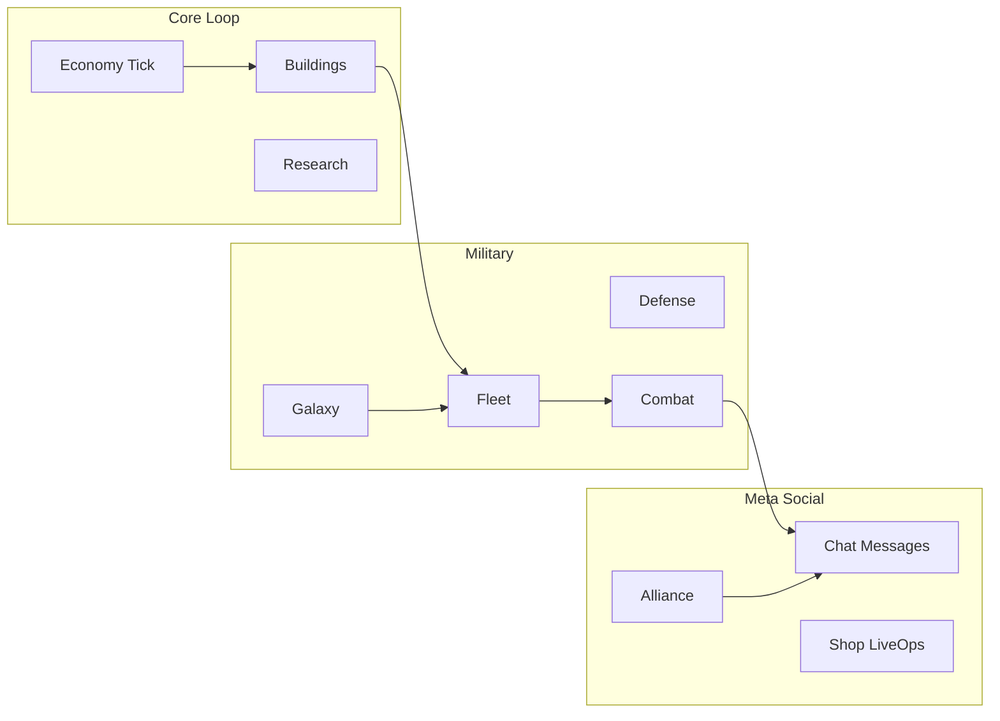

# Genesis Colonies — Was es kann, was es noch verträgt

**Stand:** Alpha `0.5.9.48` · Stack Flask + **SQLite (WAL)** + Vanilla JS/PJAX · ~4000+ pytest-Tests  
**Strategie:** Completion-First — fertigmachen vor Greenfield.  
**Produktentscheidung DB:** SQLite bleibt der produktive Pfad (1 Writer, 1 Gunicorn-Worker, Volume, Backups). Postgres-Cutover ist **nicht** geplant — siehe [RAILWAY_OPERATOR.md](RAILWAY_OPERATOR.md).

Verwandt: [PROJECT_INVENTORY.md](PROJECT_INVENTORY.md) · [ROADMAP.md](ROADMAP.md) · [BETA_GATE.md](BETA_GATE.md)

---

## Was das Projekt schon kann

### Kern-Loop (stabil)

- Auth (Register/Login, E-Mail, Passwort-Reset; Argon2id + Legacy-Migrate-on-Login)
- Ressourcen-Tick, Energie, EffectResolver
- Gebäude + Bau-Queue, Account-Forschung + Tech-Tree
- Multi-Kolonie (Planet Scope, Switcher, Kolonisierung, Löschen)
- SPA/PJAX, Singleton-Polling (`/api/game-state`), rAF-Queue-UI

### Militär & Expansion

- Galaxie, Werft, Flotte (Send/Tick/Missionen)
- Verteidigung, Combat-Resolver (Loot, Debris, Reports, Ranking)
- Combat-Simulator (Monte-Carlo)
- Recycler, Logistics (Collect/Distribute), Spy/Espionage, Expeditionen
- Imperium-Layer großteils: Command Map (Dev-Preview), Regionen, Influence, Expansion Sites, Foreign Presence — klassische Galaxie bleibt Hauptflow

### Wirtschaft & Meta

- Trader Hub (Exchange, Scrapyard), Auktionshaus, Inventar/Loot
- Vote Center (mehrere Provider)
- Shop (PayPal/Stripe Convenience), Battle Pass, Login-Kalender
- Timekeeper (Empire-Zeit auf Queues), Pirate Ecosystem, World Boss

### Social & Ops

- Messages, Chat, PlayerCard, Ranking, Referrals
- **Alliance MVP** (Hub, Spenden, Projekte, Tech, Boni) — Deep-Hooks post-Beta
- Admin Control Center, Audit, Balance, Bans, Support
- i18n-Dateien (`de/en/es/fr/pl/pt/ru/tr`), Story-TTS
- Docker/Railway-Deploy, Health, Migrationen, embedded Cron

---

## Was es noch vertragen könnte (ohne Postgres)

Priorisiert nach Spielerwert und Beta-Reife. Kein zweites Combat-/Queue-/Fleet-System — Owner erweitern.

### P0 — Sofort durchziehen

1. **Combat polish (GC-700E)** — ✅ Report-UX residual (coord CTAs, empty loot, kind badges). Optional follow-up: colony-wipe metadata in report.

**Danach:** direkt **P2** (Alliance Kriegs-/Diplomatie, Imperium Presence, Marketplace).  
**Zurückgestellt:** Beta Gate (GC-BETA-001…003), First 30 (GC-621), sowie übriges P1 (Collector, Megabunker, i18n).

### P0 Ops (parallel, kein Feature)

2. **SQLite-Ops sauber halten**: 1 Replica/Worker, Cron-Sidecar, Backups — [RAILWAY_OPERATOR.md](RAILWAY_OPERATOR.md)

### P1 — zurückgestellt

3. Beta Gate, First-30 (GC-621), Collector Exchange, Megabunker (GC-557), i18n Switch

### P2 — nach Combat Polish (aktiv)

4. **Alliance Kriegs-/Diplomatie-Hooks**
   - ✅ **GC-AL-DIP-01** — NAP-Attack-Lock, Bündnis-Transport, war-Flag in `resolve_fleet_target`
   - 📋 Kriegs-Meta (Reports/Score), End-War UI
5. **Imperium Presence-Stack** (GC-566B Dynamic Influence, später GC-568 Territorial Warfare; GC-571 bereits shipped)
6. **Player Marketplace**

### P3 — Content & Polish (nicht blockierend)

11. Radar/Scan-Layer (Gebäude impliziert Feature)
12. Season / Universe-Reset-Ops
13. Optional: Recycler UX (GC-800C), Logistics `auto_cargo`, Balancing-Tooling
14. Contract-Schuld: Shipyard `{ok,state}` (GC-512D), Legacy-Admin-Forms, `fleet_presets` CHECK, Resource INTEGER (GC-622B)

**Bewusst nicht priorisieren:** WebSocket (Polling funktioniert), CDN/Asset-Pipeline, parallele Engines, Postgres-Cutover.

---

## Kurzfazit

Genesis Colonies kann schon **ein volles Kolonie-Strategiespiel**: bauen, forschen, fliegen, kämpfen, handeln, alliieren, LiveOps, Admin. Aktuelle Spur: **GC-700E ✅ → GC-AL-DIP-01 ✅ → P2 Rest** (Kriegs-Meta / Imperium / Marketplace). Postgres-Cutover nicht geplant.
