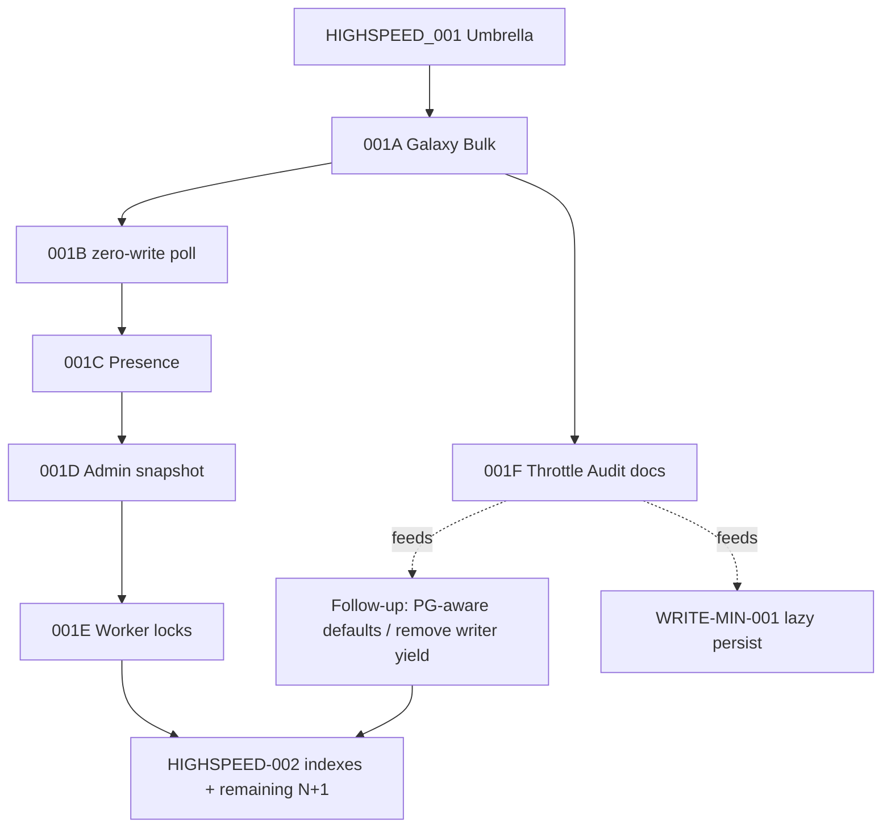

# GC-PG-HIGHSPEED-001F — SQLite Legacy Throttle Audit

> Status: 📋 **Docs-only audit** · Code unlocks are explicitly deferred  
> Parent: [GC_PG_HIGHSPEED_001.md](GC_PG_HIGHSPEED_001.md) · Performance Core: [GC_PERF_CORE.md](GC_PERF_CORE.md)  
> Scheduling: start **after 001A Galaxy Bulk**; may run in parallel with **001B** because 001F itself changes no runtime defaults.

---

## Goal

PostgreSQL is production-authoritative. `GC-PG-HIGHSPEED-001A…E` remove hotpath roundtrips, writes and lock contention. This audit inventories a second class of performance debt: **SQLite-era throttles and serialization safeguards** that were intentionally conservative around a single-writer database and may now leave PostgreSQL capacity unused.

This ticket does **not** flip any runtime defaults. It records owner, current default, the original WHY from code/docs, classification, and the follow-up owner that may later change behavior under measured Soft-On tests.

### Hard rule

Never replace SQLite conservatism with `limits = 999999`.

Every future **REMOVE** or **PG-RETUNE** must ship as its own micro-ticket with before/after evidence (`hold_ms`, SQL/opens, Admin spikes, request p95) and a safe rollback/Soft-Off path where applicable.

---

## Classification schema

| Label | Meaning |
|---|---|
| **KEEP** | Backend-independent protection or product behavior: thundering-herd control, overlap guards, kill-switches, short-TX principle, gameplay pace. |
| **PG-RETUNE** | Keep the knob/pattern, but the SQLite-era default is potentially too conservative for PostgreSQL. Retune only from measurements; backend-aware defaults are allowed. |
| **REMOVE** | Pure single-writer relic on the PostgreSQL path. SQLite may keep the behavior. |
| **REPLACE** | Do not tune the old mechanism; replace the pattern with a better architecture (for example lazy materialization). |

---

## Evidence rules

- **WHY must be sourced** from a code comment or existing project doc; no invented rationale.
- If code already branches by backend, record the actual current behavior instead of assuming a migration TODO.
- `KEEP` does not mean "never optimize"; it means the underlying guard remains valid after PostgreSQL.
- `PG-RETUNE` does not pre-authorize a new number. The follow-up ticket owns the measurement and default change.
- No feature kill is an optimization target. Existing kill-switches remain incident controls.

---

# Inventory

## A. Inactive Autoplay — strongest SQLite-era writer throttle

Owner: [`game/inactive_autoplay.py`](../game/inactive_autoplay.py) · Design: [`INACTIVE_AUTOPLAY.md`](INACTIVE_AUTOPLAY.md)

The strongest direct evidence is in the implementation comments:

- `DEFAULT_TICK_PER_CRON = 1`: "one heavy economy per cron ... so sticky-roster bursts do not serialize SQLite against human HTTP writers."
- `DEFAULT_YIELD_MS = 50`: "Yield between short-TX player economies so gunicorn can grab the writer."
- Progression cadence says it avoids "increasing the global SQLite writer budget."

| Symbol / pattern | Current code default | WHY evidence | Class | Follow-up |
|---|---:|---|---|---|
| `GC_INACTIVE_AUTOPLAY_YIELD_MS` + `time.sleep` between write steps | **50 ms** | Explicit writer handoff: yield between short-TX economies so Gunicorn can grab the writer. | **REMOVE** on PG path; SQLite may keep | **001F1**: backend-aware yield; PG candidate default `0` only after Soft-On measurement |
| `GC_INACTIVE_AUTOPLAY_TICK_BUDGET_MS` | **800 ms** | Wall-time circuit breaker stops further standing economies; protects service from runaway work, not only SQLite locks. | **PG-RETUNE** | **001F1**: retain ceiling/backpressure, measure a PG-safe higher budget |
| `GC_INACTIVE_AUTOPLAY_TICK_PER_CRON` | **1** | Code comment explicitly reduced from 3 to stop SQLite serialization against human HTTP writers. | **PG-RETUNE** | **001F1**: measured PG batch count |
| `INACTIVE_CHAIN_LIMIT` | **1** | Comment: no same-tick force-complete chains; surrounding design also limits writer burst. Gameplay pacing and DB pressure are mixed concerns. | **PG-RETUNE** | **001F1**: separate gameplay pace from DB writer budget before any change |
| `GC_INACTIVE_AUTOPLAY_BATCH` / wake batch | **1** | Day-shift wake is deliberately sparse; old implementations used larger mass rosters and were reduced for load/pacing. | **PG-RETUNE** | **001F1**: measure wake burst independently from visible shift size |
| `GC_INACTIVE_AUTOPLAY_ECONOMY_INTERVAL_SEC` | **300 s** | Standing economy is gated away from fleet-due storms; interval is a load/pacing control. | **PG-RETUNE** | **001F1**: measure frequency after 001E short/try-lock work |
| `GC_INACTIVE_AUTOPLAY_INTERVAL_SEC` / shift cap / soft-off | **900 s** / **3** / kill-switch | Shift size is product-facing presence; soft-off is an incident control. | **KEEP** | No unlock ticket for the principle; product tuning remains separate |
| Busy lease `inactive_autoplay_busy` | stale **900 s** | Cross-process overlap guard, same pattern as ranking worker. | **KEEP** | 001E may replace implementation with PG try-lock, but overlap ownership remains |
| Stage `manage_tx=False` + short write TXs | — | Comment: function owns short transactions so HTTP is not blocked for an entire multi-player economy pass. | **KEEP** principle | **001E** may permit larger measured batches while transactions remain short |

### Audit conclusion A

Autoplay contains **real, explicit SQLite-era brakes**. The clearest pure relic is the inter-write sleep. Batch/budget/cadence controls are not deleted wholesale: PostgreSQL removes the global single-writer reason, but service backpressure and gameplay pacing still exist.

---

## B. Writer-lock primitives

Owner: [`game/db.py`](../game/db.py) and short-TX owners such as [`game/fleet_worker.py`](../game/fleet_worker.py)

Current code already contains important backend branches; this audit records them so later tickets do not "fix" behavior that is already correct.

| Symbol / pattern | Current behavior | WHY evidence / verification | Class | Follow-up |
|---|---|---|---|---|
| SQLite `PRAGMA busy_timeout=20000` | Executed only in SQLite `db()` branch | Comment: wait for writers instead of immediate `SQLITE_BUSY`. PG connection path returns before SQLite PRAGMAs. | **KEEP SQLite / no-op PG** | **001F2** documents contract; no PG change needed |
| `BEGIN IMMEDIATE` vs `BEGIN` | **Verified branched** | `begin_write_transaction`: PostgreSQL executes plain `BEGIN`; SQLite executes `BEGIN IMMEDIATE`. | **KEEP current branch** | **001F2** add regression assertion only if missing |
| `_SQLITE_WRITE_MUTEX` | **Verified no-op on PG** | `_write_mutex_acquire/release` immediately return when backend is not `sqlite`; `write_mutex_depth()` is always 0 on PG. | **REMOVE/no-op PG already achieved** | **001F2** documentation/regression coverage; no runtime rewrite required unless another direct mutex use is found |
| SQLite retry sleep in `begin_write_transaction` | Only reached through `sqlite3.OperationalError` retry path | Exponential sleep is specifically for SQLite busy/locked retry. | **KEEP SQLite / no-op PG** | **001F2** verify no generic PG caller routes into SQLite retry logic |
| Fleet/Pirate/Autoplay short-TX comments about "HTTP writers interleave" | Short-TX ownership remains valuable; some batch sizes were selected for SQLite writer fairness | `fleet_worker` explicitly separates stages so one loop does not hold `BEGIN IMMEDIATE` over the whole bag; `manage_tx=False` gives inner owners short commits. | **PG-RETUNE** batching, **KEEP** short-TX principle | **001E** + targeted micro-tickets |

### Audit conclusion B

The central DB abstraction already avoids the worst mistake: PostgreSQL does **not** take the process-local SQLite writer mutex and does **not** use `BEGIN IMMEDIATE`. 001F2 is therefore mainly a verification/defaults ticket, not permission to rewrite transaction semantics.

---

## C. Poll / persist / runtime workers

Owners: [`game/config.py`](../game/config.py), [`game/queue_poll.py`](../game/queue_poll.py), presence owner in `game/models.py`, client polling, Docker/Gunicorn runtime.

| Symbol / pattern | Current default | WHY evidence | Class | Follow-up |
|---|---:|---|---|---|
| `GC_RESOURCE_PERSIST_SEC` | **600 s** | Config: minimum idle seconds before a poll may persist projected resources; raised from hardcoded 120 to reduce writes. | **REPLACE** | **GC-PERF-WRITE-MIN-001**: materialize on mutation/rate boundary; do not blindly shorten the interval |
| `GC_POLL_FINISH_INTERVAL_SEC` | **25 s** | `queue_poll.py`: avoids `BEGIN IMMEDIATE` on every `/api/game-state` tick while keeping due work bounded. | **PG-RETUNE**; worker-primary principle **KEEP** | **001B/001E**: make poll read-only where possible; worker remains primary finisher |
| Presence `touch_player_online` coarse throttle + #133 local lock soft-skip | coarse heartbeat; #133 PG lock wait capped locally | Presence is best-effort telemetry/control handback, not authoritative gameplay mutation. | **KEEP / mild retune later** | **001C** moves presence off the player hot-row / poll path |
| Production poll cadence | code/env family around **5s active / 12s idle / 30s hidden** | `game.config` explicitly says production defaults are slower "to reduce SQLite lock pressure on small hosts." | **PG-RETUNE** | After **001B** zero-write poll, retune from measured request cost; do not accelerate a chatty poll first |
| Stable client `applyPollJitter` | **±12.5%** | PERF-AUTO-005 intentionally spreads tabs to avoid synchronized polling; backend-independent thundering-herd control. | **KEEP** | None; preserve when cadence changes |
| Maintenance sidecar / no heavy HTTP piggyback | sidecar owns maintenance bag in production | Separates global maintenance CPU/GIL/DB work from Gunicorn; backend-independent availability win. | **KEEP** | **001E** improves ownership/try-locks inside the worker |
| `GC_FLASK_THREADED` local-dev default | SQLite dev defaults serialized (`0`); browser tooling commonly forces `1` | Existing test/docs explicitly describe local SQLite serialization to avoid lock/CloseWait behavior. | **PG-RETUNE** local PG default | **001F2**: backend-aware local-dev default, without changing SQLite dev behavior |
| Gunicorn workers | config helper: SQLite default **1**, non-SQLite default **2**; production entrypoint currently has its own conservative runtime defaults | Config comment: "SQLite allows one writer — default 1"; PostgreSQL can use multiple workers but pool/worker contention must be measured. | **PG-RETUNE** after lock ownership work | **001F2**, only after **001E** + pool measurement |

### Important dependency

Do **not** make polling faster before 001B removes poll-side writes and 001A/002 remove chatty query patterns. A PostgreSQL backend does not make 500 roundtrips cheap.

---

## D. Ranking / maintenance / load guard

Owners: [`game/ranking_worker.py`](../game/ranking_worker.py), [`game/fleet_worker.py`](../game/fleet_worker.py), [`game/config.py`](../game/config.py), [`PERFORMANCE.md`](PERFORMANCE.md)

| Symbol / pattern | Current default | WHY evidence | Class | Follow-up |
|---|---:|---|---|---|
| Ranking dirty model + `RANKING_WORKER_INTERVAL_SEC` | **600 s** | Gameplay marks score dirty; background owner batches refresh/rank work instead of recomputing in every mutation/request. | **KEEP** architecture | Set-based rank rewrite under **001E** or dedicated micro-ticket; cadence can be revisited after query rewrite |
| Dirty batch / worker busy guard | bounded batch + overlap guard | Prevents duplicate cross-process ranking ownership and bounds work. | **KEEP** | 001E may use PG advisory try-lock but preserves single owner |
| `GC_POST_FLEET_MAINTENANCE_BUDGET_SEC` | **25 s** | Fleet worker stops later stages once the wall budget is exhausted; protects HTTP/service availability from a large maintenance bag. | **PG-RETUNE** | **001E**: shorten stage TXs/try-lock first, then measure budget ceiling |
| Embedded cron cadence | **60 s** | Global maintenance cadence; ranking/vote self-throttle inside the bag. | **KEEP** | No cadence increase merely because PG is live |
| PERF-AUTO-006 Load Guard | planned, not active owner yet | Design defers only non-gameplay work under pressure; authoritative resource/queue/fleet mutations must never be skipped. | **KEEP** design | Implement only from measured PG pressure evidence |

---

# Explicitly NOT unlocked by 001F

The following remain deliberate even after the audit:

- Stable poll jitter / thundering-herd spreading.
- Soft-Off / kill-switches as incident controls.
- Short, atomic transactions for real mutations.
- Cross-process overlap guards / single-owner jobs.
- Authoritative spend, queue, fleet, combat and shop locks.
- Worker-primary maintenance instead of heavy work piggybacked onto HTTP.
- Gameplay pacing limits unless a product decision separately changes them.

001F also does **not**:

- change `YIELD_MS`, batch size, budgets, worker counts or cron intervals;
- raise `GC_PG_LOCK_TIMEOUT`;
- implement Galaxy/Buildings/Research N+1 fixes;
- implement resource materialize-on-mutation;
- deploy anything to production.

---

# `.env.example` drift discovered by the audit

This audit intentionally **does not edit runtime defaults**, but the environment template is stale enough to be dangerous as operator documentation.

Observed drift on the 001F base:

| `.env.example` text | Current code / production reality | Action |
|---|---|---|
| Database section still calls SQLite the default and describes Postgres production cutover as gated/future | Production cutover completed 2026-08-31; PostgreSQL is authoritative live | Documentation cleanup ticket; never infer current prod backend from `.env.example` |
| Production example still shows `GC_DB_PATH=/data/game.db`, `GUNICORN_WORKERS=1`, `GC_EMBEDDED_CRON=1` as the old SQLite-shaped recipe | Live runtime uses PostgreSQL + maintenance sidecar; worker count/pool now need PG-aware measurement | **001F2 / ops-doc cleanup** |
| Inactive example: `BATCH=3`, interval `600`, revisit `129600`, max sessions `40`, tick/cron `8` | Current code: batch **1**, wake **900**, revisit **43200**, max sessions **3**, tick/cron **1** | Fix template in a separate documentation cleanup or 001F1 PR when defaults are intentionally decided |
| Template omits current `ECONOMY_INTERVAL_SEC`, `YIELD_MS`, `TICK_BUDGET_MS` knobs | Code defaults are **300 / 50 / 800** | Add when 001F1 establishes PG-aware guidance; do not silently encode proposed values now |

**Rule:** `.env.example` is not a source of truth for current production knobs until this drift is reconciled.

---

# Follow-up tickets

## GC-PG-HIGHSPEED-001F1 — PG-aware Autoplay Defaults

Scope after 001A and preferably after 001E worker ownership groundwork:

- Make the inter-economy yield backend-aware; candidate PG value `0`, SQLite keeps writer-yield behavior.
- Measure `TICK_PER_CRON`, wall budget, wake batch and economy cadence independently.
- Keep visible shift cap/product pacing separate from DB throughput.
- Soft-On A/B with `hold_ms`, write commits, Admin spikes and HTTP p95.
- One small change set at a time; no maxed-out limits.

## GC-PG-HIGHSPEED-001F2 — DB/runtime backend-default verification

- Regression-proof `_SQLITE_WRITE_MUTEX` and `busy_timeout` as SQLite-only.
- Regression-proof `BEGIN IMMEDIATE` SQLite vs `BEGIN` PostgreSQL.
- Review backend-aware local Flask threading default.
- Review Gunicorn worker + pool sizing **after 001E**, from observed concurrent DB use.
- Reconcile stale `.env.example` / operator guidance; no secret values.

## Existing: GC-PERF-WRITE-MIN-001

`GC_RESOURCE_PERSIST_SEC` is **REPLACE**, not a "make it 30 seconds" knob. Move resource authority toward timestamp/rate projection with materialization on real mutations and rate-change boundaries.

## Existing: 001E Worker non-blocking ownership

PG try-lock/advisory ownership, short maintenance transactions, World Boss stage decomposition and worker/HTTP isolation remain owned by 001E or dedicated micro-tickets.

---

# Roadmap placement

001F starts after 001A and can run in parallel with 001B because it is documentation/inventory only. **Runtime unlocks are separate PRs.**

---

# Acceptance checklist

- [x] Every inventoried item has **KEEP / PG-RETUNE / REMOVE / REPLACE** and an owner path.
- [x] Every classification has a sourced WHY from current code/docs; backend branches were verified where possible.
- [x] Poll jitter, Soft-Off, short-TX principle and busy/overlap ownership are explicitly preserved.
- [x] Follow-up tickets 001F1 / 001F2 / WRITE-MIN-001 / 001E are separated from this audit.
- [x] `.env.example` drift is recorded without flipping defaults.
- [x] No product code, runtime default, production config or deployment change is part of 001F.
