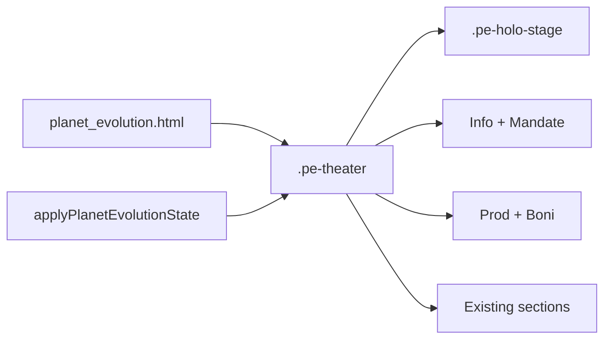

# PE Theater — Planet Evolution AAA Surface

> **Status:** Design-Freeze / Spec  
> **Stand:** 2026-08-07  
> **Owner UI:** `templates/planet_evolution.html` + `.planet-evolution-page.pe-theater` in `static/style.css`  
> **Owner JS:** `initPlanetEvolution` / `applyPlanetEvolutionState` in `static/main.js`  
> **Gameplay Cap:** [IMPERIAL_MANDATES.md](IMPERIAL_MANDATES.md) (unverändert — nur Darstellung)

---

## Problem

Der PE-Mittelteil ist ein dichter Formular-Stack (Hero-Monolith + Drawer + Listen). Er fühlt sich nicht nach „Planet entwickeln“ an — und Soft-Lock-CTAs („Ark weiterentwickeln“) wirken wie Tabellenverwaltung.

## Zielbild

Eine **kompositorische Bühne**: animierter Hologramm-Planet in der Mitte, Info-Panels links/rechts, Tab-Navigation oben.

### Design-Referenzen

| Datei | Inhalt |
|-------|--------|
| `assets/pe-theater-overview-mockup.png` | Übersicht: Bühne + L/R-Panels + Mandate-Teaser |
| `assets/pe-hologram-planet-hero-concept.png` | Hero-Close-up (Planet + Pedestal + Orbits) |
| `assets/pe-theater-development-mandates-mockup.png` | Tab Entwicklung + Mandate-Rail |

```text
┌─────────────────────────────────────────────────────────┐
│         PLANET-ENTWICKLUNG · Name · Stufe     [? Chronik]│
│  [Heimatwelt] [Status] [Rarity]                          │
│                                                         │
│  Stufe 30/30     ◯ HOLO-PLANET ◯      Planetenboni      │
│  Planetentyp     orbital + scan         Affinity %      │
│  Planetenwert    pedestal + beam                        │
│  Produktion                                             │
│  ════════════ XP-Bar / capped text ═══════════════════  │
│  Heute XP · Expeditionen                                │
└─────────────────────────────────────────────────────────┘
```

**Live-Daten (kein Mock-Gravity/Diameter):** Entwicklungsstufe, Planetentyp+Koordinaten, Planetenwert, Produktionsexport, DNA-Affinities, Activity-XP.

---

## Design-Regeln

| Pflicht | Detail |
|---------|--------|
| GC-Look | Industriell, scharf; Radius `0–2px` / `--gc-radius-sm`; **keine** Pills |
| Shell | Header / Sidebars / Registry unverändert — nur PE `#main-content` |
| Server authority | Panels = Server-State; Animation rein kosmetisch |
| Mandate | Soft-Lock zeigt Survey/Mandate, nicht „Ark auf 35“ |
| Kein Parallel-System | Gleiche Queues, Actions, `applyActionState` |

Vision-Mockups mit Soft-Pills („Dark Plasma“) werden als **eckige Chips** umgesetzt.

---

## Tab → bestehende Sections

| Tab | Inhalt (bestehend, umgehängt) |
|-----|-------------------------------|
| Übersicht | Info, Fokus, XP-Teaser, Mandate-Kurzstatus, Prod/Boni |
| Entwicklung | Planet-Tech Grid + Queue + Mandate-Rail (voll) |
| Spezialisierung | Spec-Picker / Traits |
| Policies | Policy-Liste |
| Ereignisse | Active event / decisions |
| Chronik | Chronicle (Modal oder Panel) |

Expansion-Drawer wird in **Entwicklung** / Mandate-Rail integriert (kein verstecktes Soft-Lock mehr).

---

## Technik

| Stück | Ansatz |
|-------|--------|
| Layout | `.pe-theater` 3-Spalten-Grid + Tab-Bar |
| Planet | `.pe-holo-stage`: Kugel aus `--planet-landscape`, elliptische Orbit-Ringe (`rotateX`), Atmosphäre-Halo (kein harter Oval-Rahmen), Disc-Pedestal + Beam; **ohne** WebGL |
| Motion | Orbit-Spin, Globe-Drift, Beam-/Pedestal-Pulse; `prefers-reduced-motion` → static |
| Capped XP | Bei 100% / max Stufe: kein Fortschrittsbalken — Kurztext (`pe_xp_stage_complete` / `pe_hero_progress_capped`) |
| Pedestal | Asset `static/img/pe/holo-pedestal.png` (Holo-Projektor), CSS `mix-blend-mode: screen` |
| Planet switch | PE **nicht** in `PLANET_SWITCH_SKIP_SSR` — `reloadCurrentPage` lädt Theater mit korrektem Level |
| PE mutations | `finalizePeMutationSuccess({ softContent: true })` + Soft-Reload nach Queue-Finish / Timekeeper |
| JS | Extend `initPlanetEvolution`; Tab-State; Cleanup bei PJAX |
| CSS | Nur unter `.planet-evolution-page.pe-theater` — Queue-Cards global unberührt |
| Mobile | Stage oben, Panels darunter; Tabs horizontal scroll |



---

## Tickets

| Ticket | Scope |
|--------|-------|
| **GC-PE-T1** | Dieses Doc + Mockup-Freeze (done when approved) |
| **GC-PE-T2** | Theater Shell HTML/CSS + statischer Holo-Planet |
| **GC-PE-T3** | Motion + reduced-motion |
| **GC-PE-T4** | Tabs Content-Map + Mandate-Rail + CTA |
| **GC-PE-T5** | PJAX cleanup, Locales, Queue-CSS Contract-Check |

## Explizit nicht

- WebGL/Three.js (optional später)
- Shell-/Registry-Redesign
- Neue Gameplay-Formeln
- Soft SaaS-Rounding 1:1 aus Fremd-Mockups

## Erfolg

Erster Viewport = **eine Bühne**. Mandates klar. Queues/PJAX grün. Motion abschaltbar.
