# Genesis Colonies — UML-Übersicht

Technische Architektur als UML-Diagramme (Stand: **v1.5.9.2**). Ergänzt [ARCHITECTURE.md](ARCHITECTURE.md) und [CORE_ARCHITECTURE.md](CORE_ARCHITECTURE.md).

**Rendering:** Diagramme sind in [Mermaid](https://mermaid.js.org/) geschrieben. Zum Export als PNG/SVG:

- [mermaid.live](https://mermaid.live) — Code einfügen, exportieren
- VS Code / Cursor — Mermaid-Preview-Extension
- GitHub/GitLab — Mermaid wird in Markdown nativ gerendert

---

## Inhaltsverzeichnis

1. [Komponenten-Diagramm](#1-komponenten-diagramm-gesamtarchitektur)
2. [Paket-Diagramm](#2-paket-diagramm-backend-module)
3. [Klassen-Diagramm](#3-klassen-diagramm-zentrale-konzepte)
4. [Sequenz: App-Start](#4-sequenz-app-start-bootstrap)
5. [Sequenz: Live-State Polling](#5-sequenz-live-state-polling)
6. [Sequenz: Spieler-Aktion](#6-sequenz-spieler-aktion)
7. [Entity-Relationship](#7-entity-relationship-datenmodell--kern)
8. [Frontend-Shell](#8-frontend-shell-layout)
9. [Modul-Owner-Tabelle](#9-modul-owner-tabelle)
10. [PlantUML-Variante](#10-plantuml-variante)

---

## 1. Komponenten-Diagramm (Gesamtarchitektur)

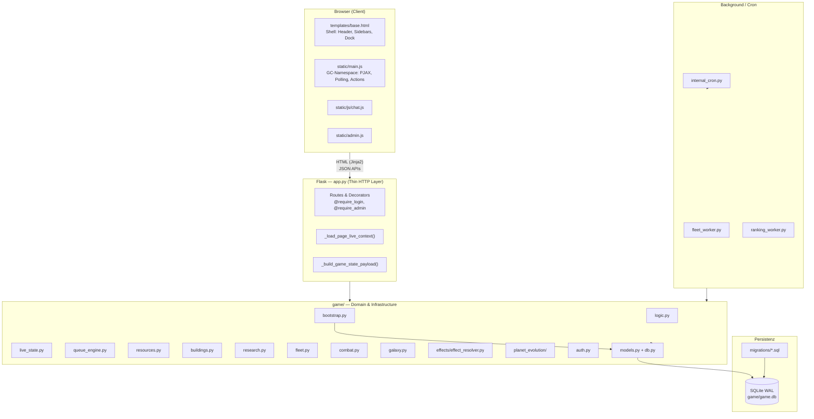

**Prinzip:** Der Server ist die einzige Wahrheit. `app.py` routet nur; die Logik lebt in `game/`.

---

## 2. Paket-Diagramm (Backend-Module)

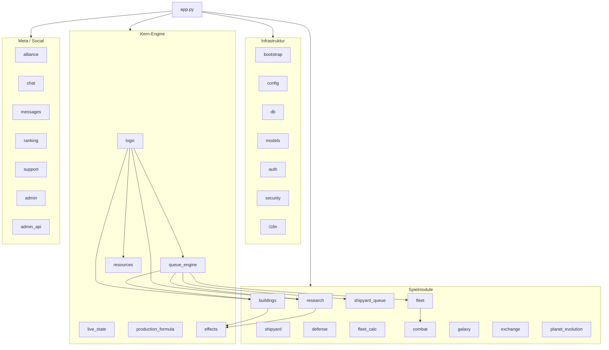

---

## 3. Klassen-Diagramm (zentrale Konzepte)

Python nutzt hier vor allem **Module + Funktionen**, keine große OOP-Hierarchie. Dieses Diagramm zeigt die **logischen Owner** laut [CORE_ARCHITECTURE.md](CORE_ARCHITECTURE.md) §17.

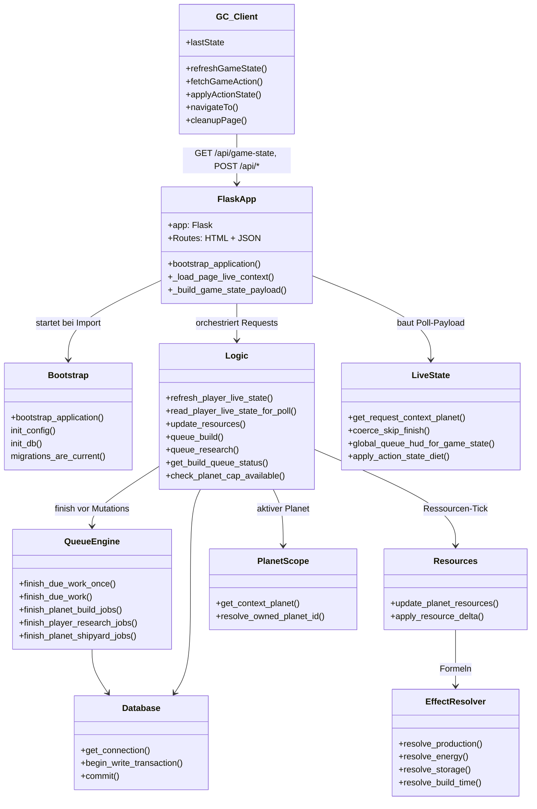

---

## 4. Sequenz: App-Start (Bootstrap)

Beim Import von `app.py` wird `bootstrap_application()` ausgeführt.

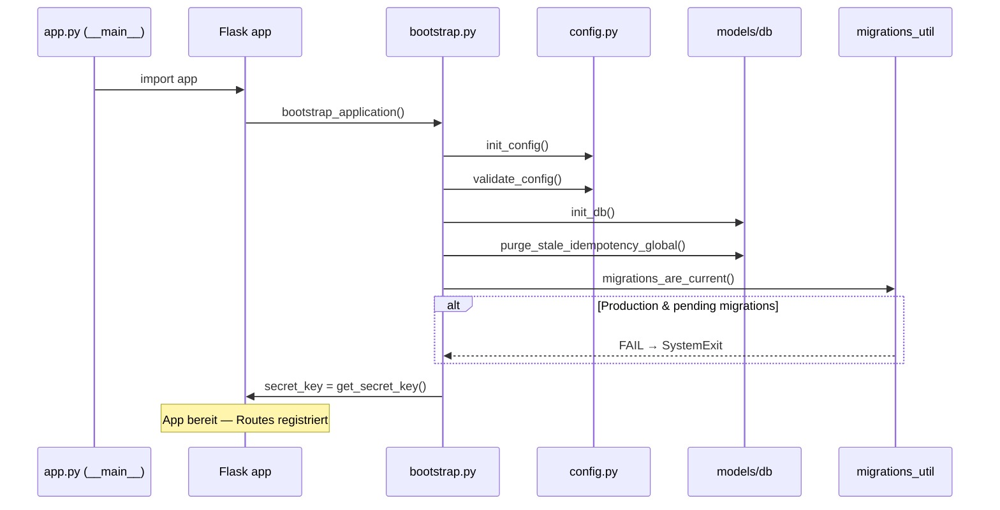

---

## 5. Sequenz: Live-State Polling

Zwei Pfade — Details: [STATE_AJAX.md](STATE_AJAX.md).

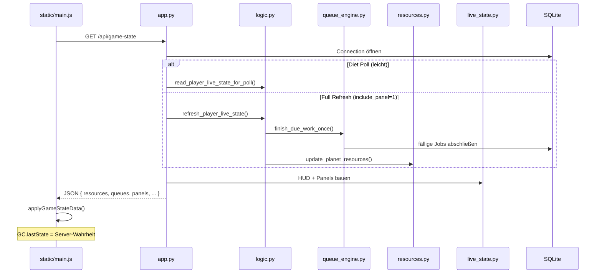

---

## 6. Sequenz: Spieler-Aktion

Beispiel: Gebäude-Upgrade. Alle POST-Actions folgen dem gleichen Contract: `{ ok, state }` → `applyActionState()`.

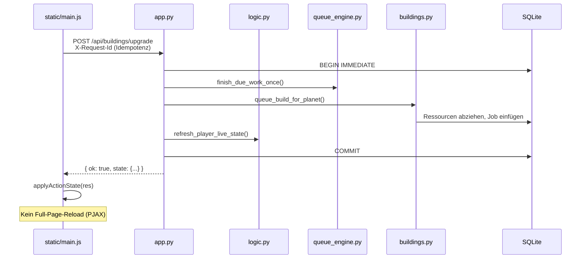

---

## 7. Entity-Relationship (Datenmodell — Kern)

Vereinfachtes ER-Diagramm der wichtigsten Tabellen. Vollständige Liste: [ARCHITECTURE.md](ARCHITECTURE.md) § Datenmodell.

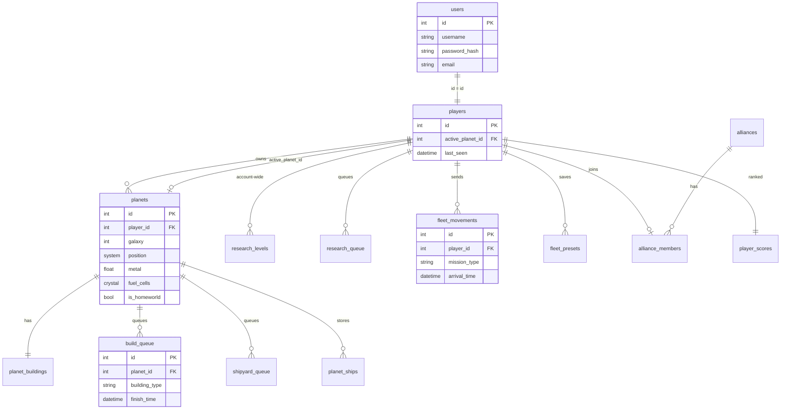

---

## 8. Frontend-Shell (Layout)

Seit GC-806: festes Dual-Sidebar-Layout. PJAX ersetzt nur `#main-content`.

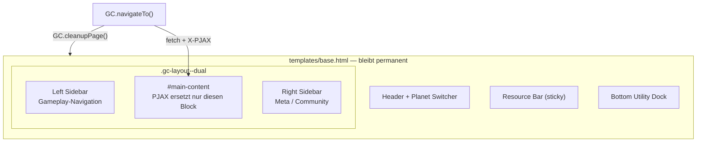

---

## 9. Modul-Owner-Tabelle

Auszug aus [CORE_ARCHITECTURE.md](CORE_ARCHITECTURE.md) §17 — „Wo gehört das hin?"

| System | Owner (Modul) | Doc |
|--------|----------------|-----|
| Queues (Finish-Pass) | `game/queue_engine.py` | [QUEUE_STATE_RULES.md](QUEUE_STATE_RULES.md) |
| Live-State / Poll-Payload | `app.py` + `game/logic.py` + `game/live_state.py` | [STATE_AJAX.md](STATE_AJAX.md) |
| Planet Scope | `game/planet_evolution/repository.py` | [PLANET_SCOPE.md](PLANET_SCOPE.md) |
| Ressourcen / Tick | `game/resources.py` | [ECONOMY_SYSTEM.md](ECONOMY_SYSTEM.md) |
| Effekte / Formeln | `game/effects/effect_resolver.py` | [EFFECTS.md](EFFECTS.md) |
| Buildings / Bau-Queue | `game/buildings.py` | [BUILDINGS_SYSTEM.md](BUILDINGS_SYSTEM.md) |
| Account-Forschung | `game/research.py` | [RESEARCH_SYSTEM.md](RESEARCH_SYSTEM.md) |
| Shipyard-Queue | `game/shipyard_queue.py`, `game/shipyard.py` | [FLEET_SYSTEM.md](FLEET_SYSTEM.md) |
| Fleet / Missionen | `game/fleet.py`, `game/fleet_calc.py` | [FLEET_SYSTEM.md](FLEET_SYSTEM.md) |
| Combat | `game/combat.py` | [COMBAT_SYSTEM.md](COMBAT_SYSTEM.md) |
| Galaxy | `game/galaxy.py` | [GALAXY_SYSTEM.md](GALAXY_SYSTEM.md) |
| Planet Evolution | `game/planet_evolution/` | [PLANET_EVOLUTION.md](PLANET_EVOLUTION.md) |
| Alliance | `game/alliance.py` | [ALLIANCE_SYSTEM.md](ALLIANCE_SYSTEM.md) |

---

## 10. PlantUML-Variante

Für Tools wie IntelliJ, draw.io (PlantUML-Plugin) oder [plantuml.com](https://www.plantuml.com/plantuml):

### Komponenten

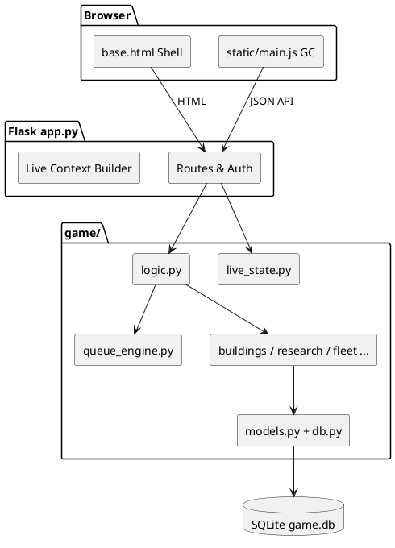

### Sequenz: Game-State Poll

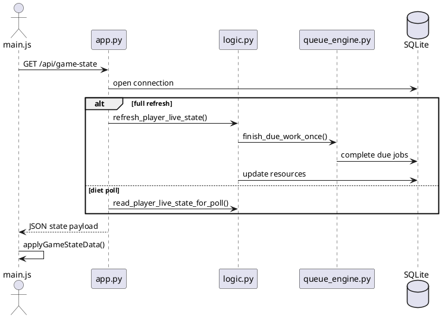

### Sequenz: POST Action

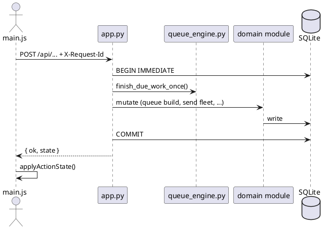

---

## Goldene Regeln (Kurzreferenz)

| Regel | Umsetzung |
|-------|-----------|
| Server = Wahrheit | Keine Frontend-Game-Math; `GC.lastState` ist Cache |
| No Full Reload | `GC.navigateTo()`, `GC.reloadCurrentPage()` — kein `location.reload()` |
| Shell First | Nur `#main-content` wird per PJAX ersetzt |
| Queue Contract | Erst `finish_due_work_once()`, dann mutieren |
| Action Contract | POST → `{ ok, state }` → `applyActionState()` |
| Planet Scope | `get_context_planet()` — kein Session-Planet |
| Thin HTTP | Logik in `game/*`, nicht in `app.py` |

Siehe [CORE_ARCHITECTURE.md](CORE_ARCHITECTURE.md) für die vollständigen GC-000-Regeln.

---

## Verwandte Dokumentation

- [ARCHITECTURE.md](ARCHITECTURE.md) — Gesamtüberblick, Request-Flows
- [CORE_ARCHITECTURE.md](CORE_ARCHITECTURE.md) — Verbindliche Architekturvorgaben
- [STATE_AJAX.md](STATE_AJAX.md) — Polling, Live-State
- [AJAX_PJAX_CONTRACT.md](AJAX_PJAX_CONTRACT.md) — Navigation, Actions
- [PROJECT_INVENTORY.md](PROJECT_INVENTORY.md) — Modul-Status aller Features
