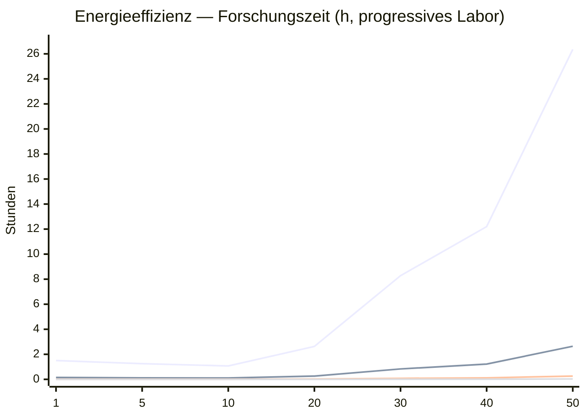
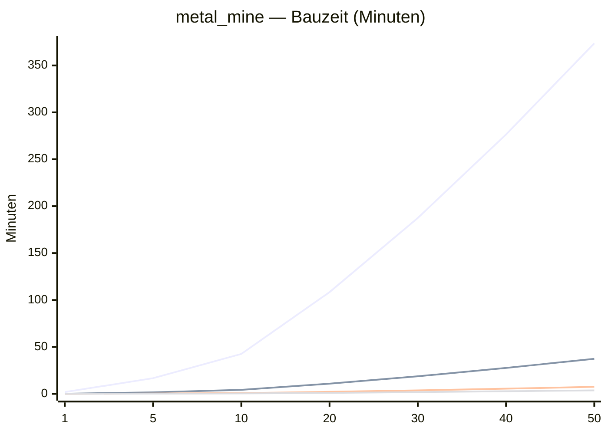
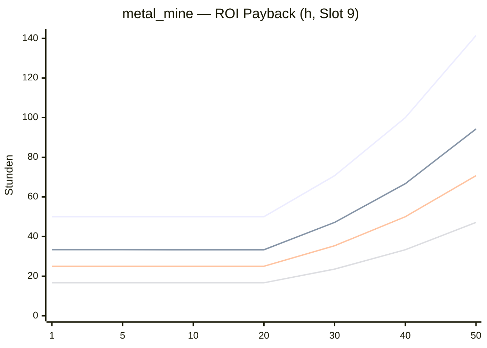

# GC-829 — Universe Speed Benchmark

> Automatisch generiert via `python scripts/universe_speed_benchmark.py` — **keine Frontend-Math**, nur kanonische Server-Formeln.

## Formeln (Kurz)

| Domäne | Owner | Formel |
|--------|-------|--------|
| Forschungszeit | `EffectResolver.get_research_time_seconds` | `anchor_hours × tier ÷ (build_speed × research_speed × lab_bonus × research_time_speed)` |
| Bauzeit | `EffectResolver.get_build_time_seconds` | `BUILD_TIME_BASE × factor^(L-1) ÷ build_speed_effective` |
| Produktion / ROI | `economy_balance.mine_upgrade_roi_hours` | `upgrade_cost ÷ Δprod/h × production_speed` |
| Flugzeit | `fleet_calc.calculate_flight_seconds` | `(35000/speed) × √(dist/10) ÷ admin_fleet_speed` |

**Annahmen Benchmark:** kein `buildtime_tech`, kein Klima/GD, `build_speed=1` in Forschungstabellen, `research_speed=1` in Bautabellen, progressive Lab-Spalte (`LAB_FOR_LEVEL`).

## Speed-Sweeps (Überblick)

### research_speed — Energieeffizienz L20, Lab 10

| research_speed | Dauer L20 Energie (Lab 10) | Stunden |
| ---: | ---: | ---: |
| 1 | 2h 37min | 2.63h |
| 2 | 1h 18min | 1.32h |
| 5 | 31:34 | 0.53h |
| 10 | 15:47 | 0.26h |
| 25 | 6:18 | 0.10h |
| 50 | 3:09 | 0.05h |
| 100 | 1:34 | 0.03h |
| 250 | instant | 0.01h |
| 500 | instant | 0.01h |
| 1000 | instant | 0.00h |

### build_speed — Ferronitmine L20

| build_speed | Dauer metal_mine L20 | Stunden |
| ---: | ---: | ---: |
| 1 | 1h 48min | 1.81h |
| 2 | 54:12 | 0.90h |
| 5 | 21:41 | 0.36h |
| 10 | 10:50 | 0.18h |
| 25 | 4:20 | 0.07h |
| 50 | 2:10 | 0.04h |
| 100 | 1:05 | 0.02h |

### production_speed — Ferronitmine ROI L20 (Slot 9)

| production_speed | ROI metal_mine L20 | Stunden |
| ---: | ---: | ---: |
| 1 | 2.1d | 50.0h |
| 1.25 | 1.7d | 40.0h |
| 1.5 | 1.4d | 33.3h |
| 1.75 | 1.2d | 28.6h |
| 2 | 1.0d | 25.0h |
| 3 | 16.7h | 16.7h |
| 5 | 10.0h | 10.0h |

## Forschung — Tabellen

Level-Spalte mit progressivem Labor (siehe `LAB_FOR_LEVEL` im Script).

### Energieeffizienz

| Level | Lab | Speed 1 | Speed 10 | Speed 100 | Speed 1000 |
| ---: | ---: | ---: | ---: | ---: | ---: |
| 1 | 1 | 1h 30min | 9min | instant | instant |
| 5 | 3 | 1h 15min | 7:30 | instant | instant |
| 10 | 5 | 1h 4min | 6:25 | instant | instant |
| 20 | 10 | 2h 37min | 15:47 | 1:34 | instant |
| 30 | 20 | 8h 16min | 49:39 | 4:57 | instant |
| 40 | 50 | 12h 12min | 1h 13min | 7:19 | instant |
| 50 | 50 | 1d 2h | 2h 38min | 15:49 | 1:34 |

#### Energieeffizienz — Labor-Effekt (Level 20)

| Level | Lab | Speed 1 | Speed 10 | Speed 100 | Speed 1000 |
| ---: | ---: | ---: | ---: | ---: | ---: |
| 20 | 1 | 4h 59min | 29:59 | 2:59 | instant |
| 20 | 5 | 3h 34min | 21:25 | 2:08 | instant |
| 20 | 10 | 2h 37min | 15:47 | 1:34 | instant |
| 20 | 20 | 1h 43min | 10:20 | 1:02 | instant |
| 20 | 50 | 50:50 | 5:05 | instant | instant |

### Metallveredelung

| Level | Lab | Speed 1 | Speed 10 | Speed 100 | Speed 1000 |
| ---: | ---: | ---: | ---: | ---: | ---: |
| 1 | 1 | 1h 37min | 9:45 | instant | instant |
| 5 | 3 | 1h 21min | 8:07 | instant | instant |
| 10 | 5 | 1h 9min | 6:57 | instant | instant |
| 20 | 10 | 2h 51min | 17:06 | 1:42 | instant |
| 30 | 20 | 8h 57min | 53:47 | 5:22 | instant |
| 40 | 50 | 13h 13min | 1h 19min | 7:55 | instant |
| 50 | 50 | 1d 4h | 2h 51min | 17:08 | 1:42 |

#### Metallveredelung — Labor-Effekt (Level 20)

| Level | Lab | Speed 1 | Speed 10 | Speed 100 | Speed 1000 |
| ---: | ---: | ---: | ---: | ---: | ---: |
| 20 | 1 | 5h 24min | 32:29 | 3:14 | instant |
| 20 | 5 | 3h 52min | 23:12 | 2:19 | instant |
| 20 | 10 | 2h 51min | 17:06 | 1:42 | instant |
| 20 | 20 | 1h 52min | 11:12 | 1:07 | instant |
| 20 | 50 | 55:04 | 5:30 | instant | instant |

### Bauoptimierung

| Level | Lab | Speed 1 | Speed 10 | Speed 100 | Speed 1000 |
| ---: | ---: | ---: | ---: | ---: | ---: |
| 1 | 1 | 1h 45min | 10:30 | 1:03 | instant |
| 5 | 3 | 1h 27min | 8:45 | instant | instant |
| 10 | 5 | 1h 15min | 7:30 | instant | instant |
| 20 | 10 | 3h 4min | 18:25 | 1:50 | instant |
| 30 | 20 | 9h 39min | 57:55 | 5:47 | instant |
| 40 | 50 | 14h 14min | 1h 25min | 8:32 | instant |
| 50 | 50 | 1d 6h | 3h 4min | 18:27 | 1:50 |

#### Bauoptimierung — Labor-Effekt (Level 20)

| Level | Lab | Speed 1 | Speed 10 | Speed 100 | Speed 1000 |
| ---: | ---: | ---: | ---: | ---: | ---: |
| 20 | 1 | 5h 49min | 34:59 | 3:29 | instant |
| 20 | 5 | 4h 9min | 24:59 | 2:29 | instant |
| 20 | 10 | 3h 4min | 18:25 | 1:50 | instant |
| 20 | 20 | 2h | 12:04 | 1:12 | instant |
| 20 | 50 | 59:19 | 5:55 | instant | instant |

### Hyperraumnavigation

| Level | Lab | Speed 1 | Speed 10 | Speed 100 | Speed 1000 |
| ---: | ---: | ---: | ---: | ---: | ---: |
| 1 | 1 | 2h 15min | 13:30 | 1:21 | instant |
| 5 | 3 | 1h 52min | 11:15 | 1:07 | instant |
| 10 | 5 | 1h 36min | 9:38 | instant | instant |
| 20 | 10 | 3h 56min | 23:41 | 2:22 | instant |
| 30 | 20 | 12h 24min | 1h 14min | 7:26 | instant |
| 40 | 50 | 18h 18min | 1h 49min | 10:58 | 1:05 |
| 50 | 50 | 1d 15h | 3h 57min | 23:43 | 2:22 |

#### Hyperraumnavigation — Labor-Effekt (Level 20)

| Level | Lab | Speed 1 | Speed 10 | Speed 100 | Speed 1000 |
| ---: | ---: | ---: | ---: | ---: | ---: |
| 20 | 1 | 7h 29min | 44:59 | 4:29 | instant |
| 20 | 5 | 5h 21min | 32:08 | 3:12 | instant |
| 20 | 10 | 3h 56min | 23:41 | 2:22 | instant |
| 20 | 20 | 2h 35min | 15:30 | 1:33 | instant |
| 20 | 50 | 1h 16min | 7:37 | instant | instant |

### Waffentechnik

| Level | Lab | Speed 1 | Speed 10 | Speed 100 | Speed 1000 |
| ---: | ---: | ---: | ---: | ---: | ---: |
| 1 | 1 | 2h | 12min | 1:12 | instant |
| 5 | 3 | 1h 40min | 10min | 1min | instant |
| 10 | 5 | 1h 25min | 8:34 | instant | instant |
| 20 | 10 | 3h 30min | 21:03 | 2:06 | instant |
| 30 | 20 | 11h 2min | 1h 6min | 6:37 | instant |
| 40 | 50 | 16h 16min | 1h 37min | 9:45 | instant |
| 50 | 50 | 1d 11h | 3h 30min | 21:05 | 2:06 |

#### Waffentechnik — Labor-Effekt (Level 20)

| Level | Lab | Speed 1 | Speed 10 | Speed 100 | Speed 1000 |
| ---: | ---: | ---: | ---: | ---: | ---: |
| 20 | 1 | 6h 39min | 39:59 | 3:59 | instant |
| 20 | 5 | 4h 45min | 28:34 | 2:51 | instant |
| 20 | 10 | 3h 30min | 21:03 | 2:06 | instant |
| 20 | 20 | 2h 17min | 13:47 | 1:22 | instant |
| 20 | 50 | 1h 7min | 6:46 | instant | instant |

## Diagramme

### 1 — Forschungszeit nach Level (Energieeffizienz)



### 2 — Bauzeit nach Level (Ferronitmine)



### 3 — Mine-ROI nach Level



## Flotte — `fleet_speed` (Referenz)

Schiff-Geschwindigkeit 1500 (langsamer Frachter-Tier), 100% Reisegeschwindigkeit, Admin-Multiplikator auf `fleet_calc`.

| Distanz | fleet_speed (×) | Flugzeit (speed 1500, 100%) |
| ---: | ---: | ---: |
| 500 | 1 | 2:45 |
| 500 | 2 | 1:23 |
| 500 | 3 | instant |
| 500 | 5 | instant |
| 500 | 10 | instant |
| 2000 | 1 | 5:30 |
| 2000 | 2 | 2:45 |
| 2000 | 3 | 1:50 |
| 2000 | 5 | 1:06 |
| 2000 | 10 | instant |
| 8000 | 1 | 11min |
| 8000 | 2 | 5:30 |
| 8000 | 3 | 3:40 |
| 8000 | 5 | 2:12 |
| 8000 | 10 | 1:06 |

## Empfehlung (Alpha)

Berechnet mit kanonischen Formeln (`EffectResolver`, GC-825/821). Referenzplanet: Slot 9.

### Leitfragen

| Frage | Datenpunkt | Einschätzung |
|-------|------------|--------------|
| Ist `research_speed = 1` spielbar? | Energie L30, Lab 20 → **8.3 h** (~0.3 d) | Technisch ja, für Alpha zu träge |
| Ist `research_speed = 100` zu schnell? | Gleiches Szenario → **0.08 h** | Midgame-Forschung wird Trivialzeit — zu schnell für Progressionsgefühl |
| Ist `build_speed = 10` sinnvoll? | `metal_mine` L20 → **10:50** | Gute Alpha-Fluidität ohne Instant-Bau |
| Ist `production_speed = 1` zu langsam? | ROI L20 → **2.1d** | Passt zu GC-821 Mine-Balance — **nicht** anheben ohne Economy-Rebalance |
| Flotte | siehe Flugtabelle | `fleet_speed` 3 → Distanz 2000 ~1:50 (speed 1500) |

### Aktuelle Defaults (`DEFAULT_GAME_SETTINGS`)

| Setting | Wert | Effekt |
|---------|-----:|--------|
| `production_speed` | 1.0 | ROI-Baseline |
| `build_speed` | 1.1 | Bau ~91% der Tabellen bei speed=1 |
| `research_speed` | 0.85 | Forschung ~118% der Tabellen bei speed=1 |
| `fleet_speed_peaceful` | 1.0 | Friedliche Flüge |

### Vorschlag Alpha-Universe

```text
production_speed = 1
build_speed      = 8
research_speed   = 50
fleet_speed      = 3   (peaceful / war / holding einheitlich)
```

**Begründung**

- **production_speed = 1** — GC-821 Mine-ROI ist darauf kalibriert; Erhöhung verkürzt Payback linear und entwertet Upgrades.
- **build_speed = 8** — `metal_mine` L20 in ~13:33; L30 Gebäude bleiben spürbar, aber nicht frustrierend.
- **research_speed = 50** — Energie L30 9:55; L10 1:17 — Alpha-taugliches Tempo ohne Instant-Forschung.
- **fleet_speed = 3** — Distanz 2000 1:50; Distanz 8000 3:40 (Referenzschiff speed 1500).

Sweet-Spot-Band (aus Sweeps): `build_speed` 5–10, `research_speed` 25–100, `production_speed` 1, `fleet_speed` 2–5.

